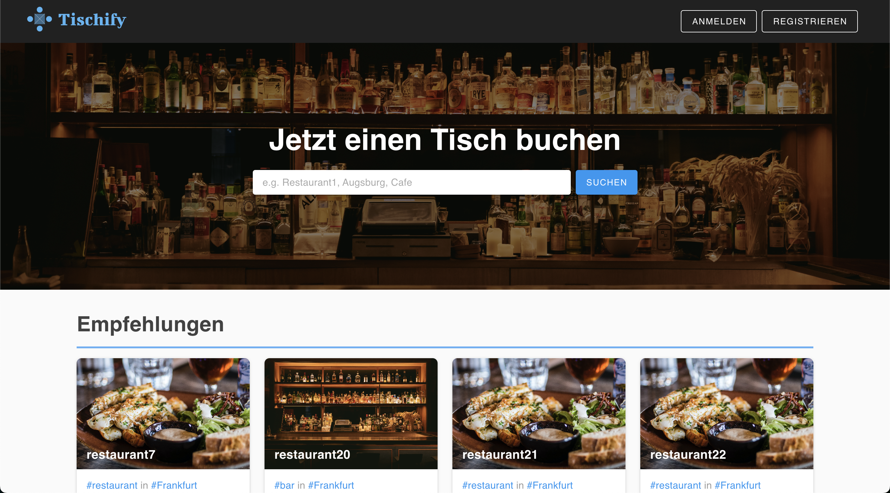

# Tischify

## A Table booking app




## Tech Stack:

- Vue 3.2 with Pinia
- Vuetify 3
- Express
- Postgres (pg.js)

### Project Setup

```sh
cd server && npm install
```

```sh
cd client && npm install
```

#### Compile and Hot-Reload for Development

```sh
cd server && node index.js
```

```sh
cd client && npm run dev
```

#### Type-Check, Compile and Minify for Production

```sh
npm run build
```

#### Run Unit Tests with [Vitest](https://vitest.dev/)

```sh
npm run test:unit
```

#### Lint with [ESLint](https://eslint.org/)

```sh
npm run lint
```
